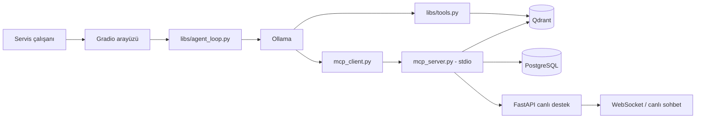

## Anadolu Isuzu Teknik Servis Chatbot Asistanı (Staj Projesi)

Anadolu Isuzu çalışanları için geliştirilmiş, yerel LLM kullanan RAG ve tool-calling tabanlı bir teknik asistandır. Sistem; bakım kılavuzları, parça katalogları, garanti kayıtları ve bakım planlarından oluşan sentetik veriler üzerinde çalışır. Kullanıcının aldığı cevabı beğenmemesi durumunda Websocket tabanlı teknik servis yetkilileri ile canlı sohbet özelliğine sahiptir.

> **Önemli:** Bu depodaki veriler sentetiktir. Garanti, stok, iş emri ve teknik bakım sonuçları gerçek servis operasyonlarında kullanılmamalıdır.


## İçindekiler

- [Mimari](#mimari)
- [Dosya Ağacı](#mimari)
- [Gereksinimler](#dosya-ağacı)
- [Kurulum](#kurulum)
- [Konfigürasyon](#konfigürasyon)
- [Hızlı başlangıç](#hızlı-başlangıç)
- [Kullanım örnekleri](#kullanım-örnekleri)
- [MCP araçları](#mcp-araçları)
- [Canlı destek API'si](#canlı-destek-apisi)
- [Veri ve indeksleme](#veri-ve-indeksleme)
- [Bilinen sınırlamalar](#bilinen-sınırlamalar)

## Mimari



Ana akış şöyledir:

1. Kullanıcı mesajı `main.py` içindeki Gradio arayüzünden alınır.
2. `libs/agent_loop.py`, Qwen modeline sistem talimatlarını ve araç şemalarını verir.
3. Doküman soruları `hybrid_query` ile Qdrant'ta dense + sparse arama kullanılarak yanıtlanır.
4. Garanti, parça, hata kodu, iş emri ve canlı destek işlemleri MCP araçları üzerinden çalıştırılır.
5. Canlı desteğe aktarımda FastAPI bir oturum açar ve Gradio arayüzüne WebSocket tabanlı sohbet alanı eklenir.
## Dosya ağacı

```text
.
├── main.py                                         Gradio sohbet arayüzünü başlatır.
├── mcp_client.py                                   MCP sunucusuna stdio üzerinden bağlanır.
├── mcp_server.py                                   Asistanın kullanabildiği MCP araçlarını sunar.
├── data/                                           Araç modellerine ait sentetik kaynak veriler.
│   ├── .../                                       
│   ├── TURKUAZ/                                    TURKUAZ modelinin örnek veri klasörü.
│   │   ├── TURKUAZ_BAKIM_PLANI.json                Bakım kilometrelerini ve işlemlerini içerir.
│   │   ├── TURKUAZ_GARANTI_KAYITLARI.json          Şasi ve garanti kayıtlarını içerir.
│   │   ├── TURKUAZ_PARCA_KATALOGU.json             Parça kodu, fiyat ve stok bilgilerini içerir.
│   │   └── TURKUAZ_SERVIS_KILAVUZU.md              Servis ve arıza giderme bilgilerini içerir.
│   └── .../                                      
├── libs/                                           Ajan ve arama yardımcı modülleri.
│   ├── agent_loop.py                               Ollama ajanını ve araç çağrı akışını yönetir.
│   ├── file_path_finder.py                         Veri klasörlerinde dosya yollarını bulur.
│   └── tools.py                                    Embedding ve Qdrant hibrit arama işlevlerini içerir.
├── live_chat/                                      FastAPI canlı destek sunucusu ve arayüzü.
│   ├── chat.js                                     Tarayıcı sohbeti ve WebSocket mesajlaşmasını yönetir.
│   ├── fastapi_server.py                           Canlı destek API uçlarını ve WebSocket'i sağlar.
│   ├── live_chat.css                               Canlı sohbet arayüzünün stillerini tanımlar.
│   └── live_chat.html                              Tarayıcıda sunulan canlı sohbet sayfası.
├── scripts/                                        Veri dönüştürme, hazırlama ve indeksleme betikleri.
│   ├── error_code_scripts/                         Hata kodlarını çıkarıp PostgreSQL'e aktaran betikler.
│   │   ├── parse_manuals.py                        Markdown kılavuzlarından hata kodlarını ayrıştırır.
│   │   └── send_to_server.py                       Hata kodu kayıtlarını PostgreSQL'e yazar.
│   ├── pdf_extraction_scripts/                     PDF kılavuzlarını Markdown'a ve örnek veriye dönüştürür.
│   │   ├── extract_manuals.py                      Docling ile PDF'leri toplu olarak dönüştürür.
│   │   ├── extract_manuals_pymupdf.py              PyMuPDF4LLM ile PDF'leri toplu dönüştürür.
│   │   ├── extract_single_pdf.py                   Tek PDF dosyasını Markdown'a dönüştürür.
│   │   └── fill_data.py                            Sentetik model bakım, garanti ve parça verileri üretir.
│   └── qdrant_scripts/                             Qdrant arama ve veri yükleme betikleri.
│       ├── basic_query_test.py                     Qdrant sorgularını hızlıca test eder.
│       ├── qdrant_send_jsons.py                    JSON verilerini embedding'lerle Qdrant'a yükler.
│       └── qdrant_send_mds.py                      Markdown kılavuzlarını parçalayıp Qdrant'a yükler.
├── qdrant_storage/                                 Yerel Qdrant verilerinin kalıcı depolama alanı.
├── devenv.nix                                      Sistem paketleri, Python ortamı ve servis tanımları.
├── devenv.yaml                                     devenv proje yapılandırması.
├── postgres_tables.sql                             PostgreSQL tablolarının şema tanımlarını içerir.
├── qdrant_collection_info.json                     Qdrant koleksiyon yapılandırma bilgilerini içerir.
└── README.md                                       Kurulum, kullanım ve mimari dokümantasyonu.

```

## Gereksinimler

Projenin çalışma ortamı ve bağımlılıkları [devenv.nix](devenv.nix) dosyasında tanımlıdır. Python sürümü, sanal ortam, sistem paketleri, CUDA destekli PyTorch indeksi, ortam değişkenleri, PostgreSQL servisi ve Qdrant süreci bu dosyadan yönetilir.


### devenv.nix sistem paketleri

- Ollama (CUDA hızlandırmalı paket)
- `tesseract`
- `libpq`

### Python paketleri

`devenv.nix` içindeki `languages.python.venv.requirements` bölümünde aşağıdaki Python paketleri bulunur:

- `torch`
- `torchvision`
- `torchaudio`
- `mcp`
- `ollama`
- `gradio`
- `fastapi`
- `fastapi-cli`
- `uvicorn`
- `qdrant-client`
- `pymupdf`
- `pymupdf4llm`
- `docling`
- `openai`
- `python-dotenv`
- `fastembed`
- `FlagEmbedding`
- `markdown_chunker`
- `chonkie`
- `psycopg[binary,pool]`
- `requests`

PyTorch paketleri için CUDA 12.1 paket deposu `devenv.nix` içinde ayrıca tanımlıdır. CUDA kullanımı için sistemde uyumlu NVIDIA sürücüleri bulunmalıdır.

Projede önerilen modeller:

```text
qwen3.5:9b
nomic-embed-text-v2-moe
```

## Kurulum

### PostgreSQL Sunucu Tabloları ve Qdrant Koleksiyon Bilgileri
`postgres_tables.sql` dosyasında gerekli tabloların oluşturulma queryleri bulunmaktadır. Bu queryleri kullanarak gerekli tabloları sunucunuzda açabilirsiniz.
`qdrant_collection_info.json` dosyasında qdrant koleksiyonu hakkında bilgiler bulunmaktadır. Bu dosyayı kullanarak qdrant sunucunuzda koleksiyonu oluşturabilirsiniz.

### devenv ile

`devenv.nix`, Python ortamını, gerekli sistem paketlerini ve isteğe bağlı yerel PostgreSQL/Qdrant süreç tanımlarını içerir.

```bash
devenv shell
```

Ollama kullanılacak makinede gerekli modelleri indirin:

```bash
ollama serve
ollama pull qwen3.5:9b
ollama pull nomic-embed-text-v2-moe
```

Ollama sunucusu ve modelleri başka bir makinede çalışıyorsa bu adımları o makinede uygulayın ve uygulamanın `.env` dosyasına uzak Ollama adresini yazın. Ollama kurulu değilse yalnızca uygulama makinesinde `ollama` Python paketinin kurulu olması yeterli değildir; erişilebilir bir Ollama sunucusu gerekir.

### Manuel Python ortamı

`devenv` kullanmıyorsanız Python 3.12 sanal ortamı oluşturup `devenv.nix` içindeki `venv.requirements` listesindeki paketleri kurun. CUDA kullanan makinelerde PyTorch sürümünü sisteminizin CUDA sürümüyle uyumlu seçin.

## Konfigürasyon

Proje kök dizininde `.env` dosyası oluşturun ve aşağıdaki anahtarları kendi çalışma ortamınızdaki URL, veritabanı ve model bilgileriyle doldurun. Aşağıdaki değerler yalnızca örnektir; kendi servis adreslerinizi ve gerekiyorsa erişim anahtarlarınızı kullanın.

```dotenv
OLLAMA_HOST=<Ollama servis URL'niz>
QDRANT_ENV_KEY=<Qdrant erişim anahtarınız>
QDRANT_URL=<Qdrant servis URL'niz>
QDRANT_COLLECTION_NAME=car_data
DENSE_EMBEDDING_MODEL=nomic-embed-text-v2-moe
DATA_PATH=data
POSTGRES_DATABASE_NAME=<PostgreSQL veritabanı adınız>
POSTGRES_HOST=<PostgreSQL sunucu adresiniz>
POSTGRES_PORT=<PostgreSQL portunuz>
POSTGRES_URL=<PostgreSQL bağlantı URL'niz>
FASTAPI_URL=<FastAPI servis URL'niz>
```

`OLLAMA_HOST`, kod içinde açıkça oluşturulan Ollama istemcisinin bağlantı adresidir. Yerel Ollama için `http://localhost:11434`, uzak Ollama için ilgili sunucunun URL'sini yazın. Kodda bazı ayarlar için varsayılan değerler bulunsa da kurulumun taşınabilir ve açık olması için tüm bağlantı bilgilerini `.env` üzerinden vermeniz önerilir.

Anahtar adlarını değiştirmeyin. Özellikle koleksiyon adı `QDRANT_COLLECTION_NAME` olarak yazılmalıdır; `QDRANDT_COLLECTION_NAME` yazımındaki bir harf farkı kod tarafından okunmaz. `.env` dosyasını Git'e eklemeyin ve erişim anahtarlarını paylaşmayın.

## Hızlı başlangıç

Bu proje, bağımlı servislerin aynı bilgisayarda çalışmasını gerektirmez. PostgreSQL, Qdrant ve Ollama başka sunucularda çalışabilir; uygulamanın hangi servislere bağlanacağı `.env` dosyasındaki URL, host ve port değerleriyle belirlenir.

#### Gradio arayüzlü ana uygulama için: 

```bash
python main.py
```

#### Canlı destek FastAPI sunucusunu bu uygulama makinesinde çalıştıracaksanız ayrı bir terminalde:

```bash
uvicorn live_chat.fastapi_server:app --reload
```

#### Ollama sunucusu aynı makinede çalışacak ise ayrı bir terminalde:
```bash
OLLAMA_CONTEXT_LENGTH=32000 ollama serve
```
**ÖNERİ :** LLM'in istenilen cevapları verebilmesi için context uzunluğunu 32k veya daha uzun token olacak şekilde ayarlayın.

#### MCP sunucusu aynı makinede çalışacak ise ayrı bir terminalde:

```bash
python mcp_server.py
```

#### Yerel PostgreSQL ve Qdrant

PostgreSQL'i yerel makinede çalıştırmak için kendi PostgreSQL kurulumunuzu kullanın. Qdrant için aşağıdaki Podman komutu örnek olarak verilmiştir:

```bash
podman run --rm \
	-p 6333:6333 -p 6334:6334 \
	--ulimit nofile=10000:10000 \
	-v "$(pwd)/qdrant_storage:/qdrant/storage" \
	docker.io/qdrant/qdrant
```

Qdrant verileri `qdrant_storage/` altında kalıcı olarak tutulur. Koleksiyon ve vektörler yoksa önce [veri ve indeksleme](#veri-ve-indeksleme) adımlarını tamamlayın.


## Kullanım örnekleri

Asistanın yanıtlayabildiği örnek istekler:

- `Bu şasi numaralı aracın garanti durumu nedir?`
- `180000 km bakımında hangi işlemler yapılmalı?`
- `Bu parça kodunun stok durumu nedir?`
- `CITIVOLT modelinde P0420 hata kodu ne anlama gelir?`
- `Bu araç için iş emri oluştur: fren sistemi kontrolü`
- `Yanıt yeterli olmadı, teknik elemana aktarır mısın?`

Model adı belirtilirse hibrit aramada filtre uygulanır. Desteklenen model adları `data/` altındaki klasör adlarıdır: `BIG-E`, `CITIBUS`, `CITIPORT`, `CITIVOLT`, `D-MAX`, `ELF-2600`, `GRAND_NOVO`, `GRAND_NOVOULTRA`, `GRAND_TORO`, `INTERLINER`, `KENDO`, `NOVO_NOVOLUX`, `NOVOCITI_LIFE`, `NOVOCITI_VOLT`, `TURKUAZ` ve `VISIGO`.

## MCP araçları

`mcp_server.py`, MCP sunucusunu stdio üzerinden başlatır. `mcp_client.py` bu sunucuya bağlanır ve MCP sonuçlarını Ollama'nın tool-calling formatına dönüştürür.

| Araç | Görevi | Veri kaynağı |
|---|---|---|
| `get_warranty_status(sasi_no)` | Şasiye göre garanti kaydı getirir | Qdrant metadata |
| `check_part_stock(parca_kodu)` | Parça kaydı ve stok bilgisini getirir | Qdrant metadata |
| `get_error_code_info(errcode, arac_modeli)` | Hata kodu açıklamasını getirir | PostgreSQL |
| `create_work_order(sasi_no, aciklama)` | İş emri oluşturur | PostgreSQL |
| `escalate_live_chat(chat_summary)` | Kullanıcıyı uygun teknik elemana aktarır | FastAPI + PostgreSQL |

MCP sunucusunu doğrudan test etmek için:

```bash
python mcp_server.py
```

Bu süreç stdio beklediği için normal bir HTTP sunucusu değildir; araç çağrılarını uygulama içindeki `mcp_client.py` üzerinden yapmak gerekir.

## Canlı destek API'si

FastAPI sunucusu aşağıdaki uçları sağlar:

| Metot | Uç | Açıklama |
|---|---|---|
| `POST` | `/escalate` | Müsait teknik eleman seçerek oturum açar |
| `POST` | `/sessions/{session_id}/messages` | Oturuma mesaj kaydeder ve yayınlar |
| `GET` | `/sessions/{session_id}/messages` | Oturum geçmişini getirir |
| `POST` | `/sessions/{session_id}/close` | Oturumu kapatır ve personeli yeniden müsait yapar |
| `WS` | `/ws/{session_id}` | Gerçek zamanlı mesajlaşma bağlantısı |
| `GET` | `/live-chat-ui` | Canlı sohbet HTML arayüzünü sunar |

Canlı destek için PostgreSQL'de en az `technical_staff`, `chat_sessions` ve `chat_messages` tabloları bulunmalıdır. İş emri ve hata kodu araçları için sırasıyla `work_orders` ve `error_codes` tabloları da gerekir. Şema/migration dosyaları bu depoda ayrıca tanımlı değilse tabloları ortamınıza göre oluşturmanız gerekir.

## Veri ve indeksleme

### Kaynak veri

Her araç modeli `data/<MODEL>/` altında şu dosyaları içerir:

- `<MODEL>_BAKIM_PLANI.json`
- `<MODEL>_GARANTI_KAYITLARI.json`
- `<MODEL>_PARCA_KATALOGU.json`
- `<MODEL>_SERVIS_KILAVUZU.md`

### Qdrant indeksi

`qdrant_scripts/` içindeki betikler JSON ve Markdown verilerini parçalar, embedding üretir ve `car_data` koleksiyonuna yükler. Markdown servis kılavuzlarında komşu parçaların bağlamını korumak için `window_context` alanı kullanılır.

Yeni veri yüklemeden önce:

1. Qdrant'ın çalıştığını kontrol edin.
2. Ollama embedding modelinin kullanılabilir olduğunu kontrol edin.
3. Betiklerin `DATA_PATH` ve koleksiyon ayarlarını doğrulayın.
4. Yükleme sonrası örnek sorguları çalıştırarak model filtresini ve sonuç sayısını kontrol edin.

### PDF çıkarma ve hata kodları

`scripts/pdf_extraction_scripts/` dizinindeki betikler servis kılavuzu PDF'lerini Markdown'a dönüştürür:

- `extract_manuals.py`, Docling kullanarak bir dizindeki PDF'leri topluca işler; belge yapısını ve tabloları koruyarak her PDF için `_SERVIS_KILAVUZU.md` çıktısı üretir.
- `extract_manuals_pymupdf.py`, aynı toplu dönüştürme işini PyMuPDF4LLM ile yapar.
- `extract_single_pdf.py`, tek bir PDF dosyasını Docling ile dönüştürmek için kullanılır.
- `fill_data.py`, örnek/sentetik araç verileri üretir; bakım planı, garanti, parça kataloğu ve Markdown servis kılavuzu dosyalarını model bazında oluşturur.

`scripts/error_code_scripts/` dizini, servis kılavuzlarındaki hata kodlarını PostgreSQL'e aktarma akışını içerir:

- `parse_manuals.py`, `DATA_PATH` altındaki Markdown dosyalarını tarar; başlıklardan hata kodunu, dosya yolundan araç modelini ve takip eden metinden açıklamayı çıkarır.
- `send_to_server.py`, çıkarılan hata kodu/model/açıklama kayıtlarını PostgreSQL'deki `error_codes` tablosuna ekler. Çalıştırmadan önce `.env` bağlantı ayarlarını ve tablo şemasını doğrulayın.


## Bilinen sınırlamalar

- Veriler sentetiktir ve gerçek servis kararı için güvenilir kaynak değildir.
- PostgreSQL tabloları için bu depoda otomatik migration akışı bulunmamaktadır.
- `create_work_order` ve canlı destek uçları veritabanına yazma işlemi yapar; deneme ortamında kullanın.
- MCP araçları her çağrıda stdio süreci başlattığı için yüksek trafikli kullanım için uygun değildir.
- Ajanın üst adım sınırı 40'tır; karmaşık tool zincirleri bu sınırı aşabilir.
- Qdrant ve Ollama çalışmıyorsa RAG ve embedding tabanlı sorgular başarısız olur.
- `logs.txt` her Gradio başlangıcında temizlenir; kalıcı loglama için ayrı bir log sistemi eklenmelidir.


